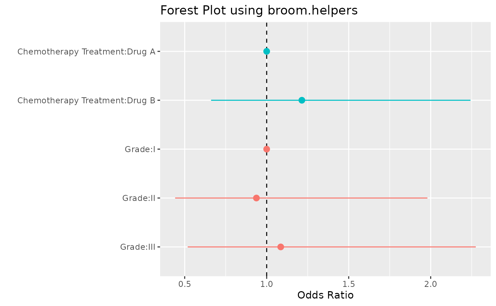

# Getting Started with broom.helpers

The `broom.helpers` package offers a suite of functions that make easy
to interact, add information, and manipulate tibbles created with
[`broom::tidy()`](https://generics.r-lib.org/reference/tidy.html) (and
friends).

The suite includes functions to group regression model terms by
variable, insert reference and header rows for categorical variables,
add variable labels, and more.

As a motivating example, let’s summarize a logistic regression model
with a forest plot and in a table.

To begin, let’s load our packages.

``` r

library(broom.helpers)
library(gtsummary)
library(ggplot2)
library(dplyr)

# paged_table() was introduced only in rmarkdwon v1.2
print_table <- function(tab) {
  if (packageVersion("rmarkdown") >= "1.2") {
    rmarkdown::paged_table(tab)
  } else {
    knitr::kable(tab)
  }
}
```

Our model predicts tumor response using chemotherapy treatment and tumor
grade. The data set we’re utilizing has already labelled the columns
using the [labelled package](https://larmarange.github.io/labelled/).
The column labels will be carried through to our figure and table.

``` r

model_logit <- glm(response ~ trt + grade, trial, family = binomial)
broom::tidy(model_logit)
#> # A tibble: 4 × 5
#>   term        estimate std.error statistic p.value
#>   <chr>          <dbl>     <dbl>     <dbl>   <dbl>
#> 1 (Intercept)  -0.879      0.305    -2.88  0.00400
#> 2 trtDrug B     0.194      0.311     0.625 0.532  
#> 3 gradeII      -0.0647     0.381    -0.170 0.865  
#> 4 gradeIII      0.0822     0.376     0.219 0.827
```

## Forest Plot

To create the figure, we’ll need to add some information to the tidy
tibble, i.e. we’ll need to group the terms that belong to the same
variable, add the reference row, etc. Parsing this information can be
difficult, but the `broom.helper` package has made it simple.

``` r

tidy_forest <-
  model_logit |>
  # perform initial tidying of the model
  tidy_and_attach(exponentiate = TRUE, conf.int = TRUE) |>
  # adding in the reference row for categorical variables
  tidy_add_reference_rows() |>
  # adding a reference value to appear in plot
  tidy_add_estimate_to_reference_rows() |>
  # adding the variable labels
  tidy_add_term_labels() |>
  # removing intercept estimate from model
  tidy_remove_intercept()
tidy_forest
#> # A tibble: 5 × 16
#>   term      variable var_label          var_class var_type var_nlevels contrasts
#>   <chr>     <chr>    <chr>              <chr>     <chr>          <int> <chr>    
#> 1 trtDrug A trt      Chemotherapy Trea… character dichoto…           2 contr.tr…
#> 2 trtDrug B trt      Chemotherapy Trea… character dichoto…           2 contr.tr…
#> 3 gradeI    grade    Grade              factor    categor…           3 contr.tr…
#> 4 gradeII   grade    Grade              factor    categor…           3 contr.tr…
#> 5 gradeIII  grade    Grade              factor    categor…           3 contr.tr…
#> # ℹ 9 more variables: contrasts_type <chr>, reference_row <lgl>, label <chr>,
#> #   estimate <dbl>, std.error <dbl>, statistic <dbl>, p.value <dbl>,
#> #   conf.low <dbl>, conf.high <dbl>
```

**Note:** we used
[`tidy_and_attach()`](https://larmarange.github.io/broom.helpers/dev/reference/tidy_attach_model.md)
instead of
[`broom::tidy()`](https://generics.r-lib.org/reference/tidy.html).
`broom.helpers` functions needs a copy of the original model. To avoid
passing the model at each step, the easier way is to attach the model as
an attribute of the tibble with
[`tidy_attach_model()`](https://larmarange.github.io/broom.helpers/dev/reference/tidy_attach_model.md).
[`tidy_and_attach()`](https://larmarange.github.io/broom.helpers/dev/reference/tidy_attach_model.md)
is simply a shortcut of
`model |> broom::tidy() |> tidy_and_attach(model)`.

We now have a tibble with every piece of information we need to create
our forest plot using `ggplot2`.

``` r

tidy_forest |>
  mutate(
    plot_label = paste(var_label, label, sep = ":") |>
      forcats::fct_inorder() |>
      forcats::fct_rev()
  ) |>
  ggplot(aes(x = plot_label, y = estimate, ymin = conf.low, ymax = conf.high, color = variable)) +
  geom_hline(yintercept = 1, linetype = 2) +
  geom_pointrange() +
  coord_flip() +
  theme(legend.position = "none") +
  labs(
    y = "Odds Ratio",
    x = " ",
    title = "Forest Plot using broom.helpers"
  )
```



**Note::** for more advanced and nicely formatted plots of model
coefficients, look at
[`ggstats::ggcoef_model()`](https://larmarange.github.io/ggstats/reference/ggcoef_model.html)
and its [dedicated
vignette](https://larmarange.github.io/ggstats/articles/ggcoef_model.html).
[`ggstats::ggcoef_model()`](https://larmarange.github.io/ggstats/reference/ggcoef_model.html)
internally uses `broom.helpers`.

## Table Summary

In addition to aiding in figure creation, the broom.helpers package can
help summarize a model in a table. In the example below, we add header
and reference rows, and utilize existing variable labels. Let’s change
the labels shown in our summary table as well.

``` r

tidy_table <-
  model_logit |>
  # perform initial tidying of the model
  tidy_and_attach(exponentiate = TRUE, conf.int = TRUE) |>
  # adding in the reference row for categorical variables
  tidy_add_reference_rows() |>
  # adding the variable labels
  tidy_add_term_labels() |>
  # add header row
  tidy_add_header_rows() |>
  # removing intercept estimate from model
  tidy_remove_intercept()

# print summary table
options(knitr.kable.NA = "")
tidy_table |>
  # format model estimates
  select(label, estimate, conf.low, conf.high, p.value) |>
  mutate(across(all_of(c("estimate", "conf.low", "conf.high")), style_ratio)) |>
  mutate(across(p.value, style_pvalue)) |>
  print_table()
```

**Note::** for more advanced and nicely formatted tables of model
coefficients, look at
[`gtsummary::tbl_regression()`](https://www.danieldsjoberg.com/gtsummary/reference/tbl_regression.html)
and its [dedicated
vignette](https://www.danieldsjoberg.com/gtsummary/articles/tbl_regression.html).
[`gtsummary::tbl_regression()`](https://www.danieldsjoberg.com/gtsummary/reference/tbl_regression.html)
internally uses `broom.helpers`.

## All-in-one function

There is also a handy wrapper, called
[`tidy_plus_plus()`](https://larmarange.github.io/broom.helpers/dev/reference/tidy_plus_plus.md),
for the most commonly used `tidy_*()` functions, and they can be
executed with a single line of code:

``` r

model_logit |>
  tidy_plus_plus(exponentiate = TRUE)
#> # A tibble: 5 × 18
#>   term      variable var_label          var_class var_type var_nlevels contrasts
#>   <chr>     <chr>    <chr>              <chr>     <chr>          <int> <chr>    
#> 1 trtDrug A trt      Chemotherapy Trea… character dichoto…           2 contr.tr…
#> 2 trtDrug B trt      Chemotherapy Trea… character dichoto…           2 contr.tr…
#> 3 gradeI    grade    Grade              factor    categor…           3 contr.tr…
#> 4 gradeII   grade    Grade              factor    categor…           3 contr.tr…
#> 5 gradeIII  grade    Grade              factor    categor…           3 contr.tr…
#> # ℹ 11 more variables: contrasts_type <chr>, reference_row <lgl>, label <chr>,
#> #   n_obs <dbl>, n_event <dbl>, estimate <dbl>, std.error <dbl>,
#> #   statistic <dbl>, p.value <dbl>, conf.low <dbl>, conf.high <dbl>
```

``` r

model_logit |>
  tidy_plus_plus(exponentiate = TRUE) |>
  print_table()
```

See the documentation of
[`tidy_plus_plus()`](https://larmarange.github.io/broom.helpers/dev/reference/tidy_plus_plus.md)
for the full list of available options.

## Advanced examples

`broom.helpers` can also handle different contrasts for categorical
variables and the use of polynomial terms for continuous variables.

### Polynomial terms

When polynomial terms of a continuous variable are defined with
[`stats::poly()`](https://rdrr.io/r/stats/poly.html), `broom.helpers`
will be able to identify the corresponding variable, and add header
rows.

``` r

model_poly <- glm(response ~ poly(age, 3) + ttdeath, na.omit(trial), family = binomial)

model_poly |>
  tidy_plus_plus(
    exponentiate = TRUE,
    add_header_rows = TRUE,
    variable_labels = c(age = "Age in years")
  ) |>
  select(term, variable, label, header_row, estimate) |>
  print_table()
```

You also have an option to relabel polynomial terms. Be aware that, by
default, [`stats::poly()`](https://rdrr.io/r/stats/poly.html) generates
orthogonal polynomials. Relabels are more appropriate with raw
polynomials.

``` r

model_poly2 <- glm(response ~ poly(age, 3, raw = TRUE) + ttdeath, na.omit(trial), family = binomial)

model_poly2 |>
  tidy_plus_plus(
    exponentiate = TRUE,
    add_header_rows = TRUE,
    variable_labels = c(age = "Age in years"),
    relabel_poly = TRUE
  ) |>
  select(term, variable, label, header_row, estimate) |>
  print_table()
```

### Different type of contrasts

By default, categorical variables are coded with a treatment contrasts
(see
[`stats::contr.treatment()`](https://rdrr.io/r/stats/contrast.html)).
With such contrasts, model coefficients correspond to the effect of a
modality compared with the reference modality (by default, the first
one).
[`tidy_add_reference_rows()`](https://larmarange.github.io/broom.helpers/dev/reference/tidy_add_reference_rows.md)
allows to add a row for this reference modality and
[`tidy_add_estimate_to_reference_rows()`](https://larmarange.github.io/broom.helpers/dev/reference/tidy_add_estimate_to_reference_rows.md)
will populate the estimate value of these references rows by 0 (or 1 if
`exponentiate = TRUE`).
[`tidy_add_term_labels()`](https://larmarange.github.io/broom.helpers/dev/reference/tidy_add_term_labels.md)
is able to retrieve the label of the factor level associated with a
specific model term.

``` r

model_1 <- glm(
  response ~ stage + grade * trt,
  gtsummary::trial,
  family = binomial
)

model_1 |>
  tidy_and_attach(exponentiate = TRUE) |>
  tidy_add_reference_rows() |>
  tidy_add_estimate_to_reference_rows(exponentiate = TRUE) |>
  tidy_add_term_labels() |>
  print_table()
```

Using
[`stats::contr.treatment()`](https://rdrr.io/r/stats/contrast.html), it
is possible to defined alternative reference rows. It will be properly
managed by `broom.helpers`.

``` r

model_2 <- glm(
  response ~ stage + grade * trt,
  gtsummary::trial,
  family = binomial,
  contrasts = list(
    stage = contr.treatment(4, base = 3),
    grade = contr.treatment(3, base = 2),
    trt = contr.treatment(2, base = 2)
  )
)

model_2 |>
  tidy_and_attach(exponentiate = TRUE) |>
  tidy_add_reference_rows() |>
  tidy_add_estimate_to_reference_rows(exponentiate = TRUE) |>
  tidy_add_term_labels() |>
  print_table()
```

You can also use sum contrasts
(cf. [`stats::contr.sum()`](https://rdrr.io/r/stats/contrast.html)). In
that case, each model coefficient corresponds to the difference of that
modality with the grand mean. A variable with 4 modalities will be coded
with 3 terms. However, a value could be computed (using
[`emmeans::emmeans()`](https://rvlenth.github.io/emmeans/reference/emmeans.html))
for the last modality, corresponding to the difference of that modality
with the grand mean and equal to sum of all other coefficients
multiplied by -1. `broom.helpers` will identify categorical variables
coded with sum contrasts and could retrieve an estimate value for the
reference term.

``` r

model_3 <- glm(
  response ~ stage + grade * trt,
  gtsummary::trial,
  family = binomial,
  contrasts = list(
    stage = contr.sum,
    grade = contr.sum,
    trt = contr.sum
  )
)

model_3 |>
  tidy_and_attach(exponentiate = TRUE) |>
  tidy_add_reference_rows() |>
  tidy_add_estimate_to_reference_rows(exponentiate = TRUE) |>
  tidy_add_term_labels() |>
  print_table()
```

Other types of contrasts exist, like Helmert
([`contr.helmert()`](https://rdrr.io/r/stats/contrast.html)) or
polynomial ([`contr.poly()`](https://rdrr.io/r/stats/contrast.html)).
They are more complex as a modality will be coded with a combination of
terms. Therefore, for such contrasts, it will not be possible to
associate a specific model term with a level of the original factor.
`broom.helpers` will not add a reference term in such case.

``` r

model_4 <- glm(
  response ~ stage + grade * trt,
  gtsummary::trial,
  family = binomial,
  contrasts = list(
    stage = contr.poly,
    grade = contr.helmert,
    trt = contr.poly
  )
)

model_4 |>
  tidy_and_attach(exponentiate = TRUE) |>
  tidy_add_reference_rows() |>
  tidy_add_estimate_to_reference_rows(exponentiate = TRUE) |>
  tidy_add_term_labels() |>
  print_table()
```

### Pairwise contrasts of categorical variable

Pairwise contrasts of categorical variables could be computed with
[`tidy_add_pairwise_contrasts()`](https://larmarange.github.io/broom.helpers/dev/reference/tidy_add_pairwise_contrasts.md).

``` r

model_logit <- glm(response ~ age + trt + grade, trial, family = binomial)

model_logit |>
  tidy_and_attach() |>
  tidy_add_pairwise_contrasts() |>
  print_table()
```

``` r


model_logit |>
  tidy_and_attach(exponentiate = TRUE) |>
  tidy_add_pairwise_contrasts() |>
  print_table()
```

``` r


model_logit |>
  tidy_and_attach(exponentiate = TRUE) |>
  tidy_add_pairwise_contrasts(pairwise_reverse = FALSE) |>
  print_table()
```

``` r


model_logit |>
  tidy_and_attach(exponentiate = TRUE) |>
  tidy_add_pairwise_contrasts(keep_model_terms = TRUE) |>
  print_table()
```

## Column Details

Below is a summary of the additional columns that may be added by a
`broom.helpers` function. The table includes the column name, the
function that adds the column, and a short description of the
information in the column.

[TABLE]

Note:
[`tidy_add_estimate_to_reference_rows()`](https://larmarange.github.io/broom.helpers/dev/reference/tidy_add_estimate_to_reference_rows.md)
does not create an additional column; rather, it populates the
‘estimate’ column for reference rows.

## Additional attributes

Below is a list of additional attributes that `broom.helpers` may
attached to the results. The table includes the attribute name, the
function that adds the attribute, and a short description.

| Attribute | Function | Description |
|----|----|----|
| coefficients_label | [`tidy_add_coefficients_type()`](https://larmarange.github.io/broom.helpers/dev/reference/tidy_add_coefficients_type.md) | Coefficients label |
| coefficients_type | [`tidy_add_coefficients_type()`](https://larmarange.github.io/broom.helpers/dev/reference/tidy_add_coefficients_type.md) | Type of coefficients |
| component | [`tidy_zeroinfl()`](https://larmarange.github.io/broom.helpers/dev/reference/tidy_zeroinfl.md) | `component` argument passed to [`tidy_zeroinfl()`](https://larmarange.github.io/broom.helpers/dev/reference/tidy_zeroinfl.md) |
| conf.level | [`tidy_and_attach()`](https://larmarange.github.io/broom.helpers/dev/reference/tidy_attach_model.md) | Level of confidence used for confidence intervals |
| exponentiate | [`tidy_and_attach()`](https://larmarange.github.io/broom.helpers/dev/reference/tidy_attach_model.md) | Indicates if estimates were exponentiated |
| Exposure | [`tidy_add_n()`](https://larmarange.github.io/broom.helpers/dev/reference/tidy_add_n.md) | Total of exposure time |
| N_event | [`tidy_add_n()`](https://larmarange.github.io/broom.helpers/dev/reference/tidy_add_n.md) | Total number of events |
| N_ind | [`tidy_add_n()`](https://larmarange.github.io/broom.helpers/dev/reference/tidy_add_n.md) | Total number of individuals (for Cox models) |
| N_obs | [`tidy_add_n()`](https://larmarange.github.io/broom.helpers/dev/reference/tidy_add_n.md) | Total number of observations |
| term_labels | [`tidy_add_term_labels()`](https://larmarange.github.io/broom.helpers/dev/reference/tidy_add_term_labels.md) | Custom term labels passed to [`tidy_add_term_labels()`](https://larmarange.github.io/broom.helpers/dev/reference/tidy_add_term_labels.md) |
| variable_labels | [`tidy_add_variable_labels()`](https://larmarange.github.io/broom.helpers/dev/reference/tidy_add_variable_labels.md) | Custom variable labels passed to [`tidy_add_variable_labels()`](https://larmarange.github.io/broom.helpers/dev/reference/tidy_add_variable_labels.md) |

## Supported models

| Model | Notes |
|----|----|
| [`betareg::betareg()`](https://rdrr.io/pkg/betareg/man/betareg.html) | Use [`tidy_parameters()`](https://larmarange.github.io/broom.helpers/dev/reference/tidy_parameters.md) as `tidy_fun` with `component` argument to control with coefficients to return. [`broom::tidy()`](https://generics.r-lib.org/reference/tidy.html) does not support the `exponentiate` argument for betareg models, use [`tidy_parameters()`](https://larmarange.github.io/broom.helpers/dev/reference/tidy_parameters.md) instead. |
| [`biglm::bigglm()`](https://rdrr.io/pkg/biglm/man/bigglm.html) |  |
| [`brms::brm()`](https://paulbuerkner.com/brms/reference/brm.html) | `broom.mixed` package required |
| [`cmprsk::crr()`](https://rdrr.io/pkg/cmprsk/man/crr.html) | Limited support. It is recommended to use [`tidycmprsk::crr()`](https://mskcc-epi-bio.github.io/tidycmprsk/reference/crr.html) instead. |
| [`fixest::feglm()`](https://lrberge.github.io/fixest/reference/feglm.html) | May fail with R \<= 4.0. |
| [`fixest::femlm()`](https://lrberge.github.io/fixest/reference/femlm.html) | May fail with R \<= 4.0. |
| [`fixest::feNmlm()`](https://lrberge.github.io/fixest/reference/feNmlm.html) | May fail with R \<= 4.0. |
| [`fixest::feols()`](https://lrberge.github.io/fixest/reference/feols.html) | May fail with R \<= 4.0. |
| [`gam::gam()`](https://rdrr.io/pkg/gam/man/gam.html) |  |
| [`geepack::geeglm()`](https://rdrr.io/pkg/geepack/man/geeglm.html) |  |
| [`glmmTMB::glmmTMB()`](https://rdrr.io/pkg/glmmTMB/man/glmmTMB.html) | `broom.mixed` package required |
| [`glmtoolbox::glmgee()`](https://rdrr.io/pkg/glmtoolbox/man/glmgee.html) |  |
| [`lavaan::lavaan()`](https://rdrr.io/pkg/lavaan/man/lavaan.html) | Limited support for categorical variables |
| [`lfe::felm()`](https://rdrr.io/pkg/lfe/man/felm.html) |  |
| [`lme4::glmer.nb()`](https://rdrr.io/pkg/lme4/man/glmer.nb.html) | `broom.mixed` package required |
| [`lme4::glmer()`](https://rdrr.io/pkg/lme4/man/glmer.html) | `broom.mixed` package required |
| [`lme4::lmer()`](https://rdrr.io/pkg/lme4/man/lmer.html) | `broom.mixed` package required |
| [`logitr::logitr()`](https://jhelvy.github.io/logitr/reference/logitr.html) | Requires logitr \>= 0.8.0 |
| [`MASS::glm.nb()`](https://rdrr.io/pkg/MASS/man/glm.nb.html) |  |
| [`MASS::polr()`](https://rdrr.io/pkg/MASS/man/polr.html) |  |
| [`mgcv::gam()`](https://rdrr.io/pkg/mgcv/man/gam.html) | Use default tidier [`broom::tidy()`](https://generics.r-lib.org/reference/tidy.html) for smooth terms only, or [`gtsummary::tidy_gam()`](https://www.danieldsjoberg.com/gtsummary/reference/custom_tidiers.html) to include parametric terms |
| [`mice::mira`](https://amices.org/mice/reference/mira.html) | Limited support. If `mod` is a `mira` object, use `tidy_fun = function(x, ...) {mice::pool(x) |> mice::tidy(...)}` |
| [`mmrm::mmrm()`](https://openpharma.github.io/mmrm/latest-tag/reference/mmrm.html) |  |
| [`multgee::nomLORgee()`](https://rdrr.io/pkg/multgee/man/nomLORgee.html) | Use [`tidy_multgee()`](https://larmarange.github.io/broom.helpers/dev/reference/tidy_multgee.md) as `tidy_fun`. |
| [`multgee::ordLORgee()`](https://rdrr.io/pkg/multgee/man/ordLORgee.html) | Use [`tidy_multgee()`](https://larmarange.github.io/broom.helpers/dev/reference/tidy_multgee.md) as `tidy_fun`. |
| [`nnet::multinom()`](https://rdrr.io/pkg/nnet/man/multinom.html) |  |
| [`ordinal::clm()`](https://rdrr.io/pkg/ordinal/man/clm.html) | Limited support for models with nominal predictors. |
| [`ordinal::clmm()`](https://rdrr.io/pkg/ordinal/man/clmm.html) | Limited support for models with nominal predictors. |
| [`parsnip::model_fit`](https://parsnip.tidymodels.org/reference/model_fit.html) | Supported as long as the type of model and the engine is supported. |
| [`plm::plm()`](https://rdrr.io/pkg/plm/man/plm.html) |  |
| [`pscl::hurdle()`](https://rdrr.io/pkg/pscl/man/hurdle.html) | Use [`tidy_zeroinfl()`](https://larmarange.github.io/broom.helpers/dev/reference/tidy_zeroinfl.md) as `tidy_fun`. |
| [`pscl::zeroinfl()`](https://rdrr.io/pkg/pscl/man/zeroinfl.html) | Use [`tidy_zeroinfl()`](https://larmarange.github.io/broom.helpers/dev/reference/tidy_zeroinfl.md) as `tidy_fun`. |
| [`quantreg::rq()`](https://rdrr.io/pkg/quantreg/man/rq.html) | If several quantiles are estimated, use [`tidy_with_broom_or_parameters()`](https://larmarange.github.io/broom.helpers/dev/reference/tidy_with_broom_or_parameters.md) tidier, the default tidier used by [`tidy_plus_plus()`](https://larmarange.github.io/broom.helpers/dev/reference/tidy_plus_plus.md). |
| [`rstanarm::stan_glm()`](https://mc-stan.org/rstanarm/reference/stan_glm.html) | `broom.mixed` package required |
| [`stats::aov()`](https://rdrr.io/r/stats/aov.html) | Reference rows are not relevant for such models. |
| [`stats::glm()`](https://rdrr.io/r/stats/glm.html) |  |
| [`stats::lm()`](https://rdrr.io/r/stats/lm.html) |  |
| [`stats::nls()`](https://rdrr.io/r/stats/nls.html) | Limited support |
| [`survey::svycoxph()`](https://rdrr.io/pkg/survey/man/svycoxph.html) |  |
| [`survey::svyglm()`](https://rdrr.io/pkg/survey/man/svyglm.html) |  |
| [`survey::svyolr()`](https://rdrr.io/pkg/survey/man/svyolr.html) |  |
| [`survival::cch()`](https://rdrr.io/pkg/survival/man/cch.html) | Experimental support. |
| [`survival::clogit()`](https://rdrr.io/pkg/survival/man/clogit.html) |  |
| [`survival::coxph()`](https://rdrr.io/pkg/survival/man/coxph.html) |  |
| [`survival::coxphms.object`](https://rdrr.io/pkg/survival/man/coxphms.object.html) | Experimental support. It is recommended to use [`tidy_coxphms()`](https://larmarange.github.io/broom.helpers/dev/reference/tidy_coxphms.md) as `tidy_fun`. |
| [`survival::survreg()`](https://rdrr.io/pkg/survival/man/survreg.html) |  |
| [`svyVGAM::svy_vglm()`](https://rdrr.io/pkg/svyVGAM/man/svy_vglm.html) | Experimental support. It is recommended to use [`tidy_svy_vglm()`](https://larmarange.github.io/broom.helpers/dev/reference/tidy_svy_vglm.md) as `tidy_fun`. |
| [`tidycmprsk::crr()`](https://mskcc-epi-bio.github.io/tidycmprsk/reference/crr.html) |  |
| [`VGAM::vgam()`](https://rdrr.io/pkg/VGAM/man/vgam.html) | Experimental support. It is recommended to use [`tidy_vgam()`](https://larmarange.github.io/broom.helpers/dev/reference/tidy_vgam.md) as `tidy_fun`. |
| [`VGAM::vglm()`](https://rdrr.io/pkg/VGAM/man/vglm.html) | Experimental support. It is recommended to use [`tidy_vgam()`](https://larmarange.github.io/broom.helpers/dev/reference/tidy_vgam.md) as `tidy_fun`. |

Note: this list of models has been tested. `broom.helpers` may or may
not work properly or partially with other types of models. Do not
hesitate to provide feedback on
[GitHub](https://github.com/larmarange/broom.helpers/issues).
