# Marginal effects / slopes, contrasts, means and predictions with broom.helpers

## Terminology

The overall idea of “marginal effects” is too provide tools to better
interpret the results of a model by estimating several quantities at the
margins. However, it has been implemented in many different ways by
different ways and there is a bunch of quasi-synonyms for the idea of
“marginal effects”: statistical effects, marginal effects, marginal
means, contrasts, marginal slopes, conditional effects, conditional
marginal effects, marginal effects at the mean, and many other
similarly-named ideas.

In [broom.helpers](https://larmarange.github.io/broom.helpers/), we
tried to adopt a terminology consistent with the
[`{marginaleffects}`](https://vincentarelbundock.github.io/marginaleffects/#definitions)
package, first released in September 2021, and with [Andrew Heiss’
Marginalia blog
post](https://www.andrewheiss.com/blog/2022/05/20/marginalia/) published
in May 2022.

**Adjusted Predictions** correspond to the outcome predicted by a fitted
model on a specified scale for a given combination of values of the
predictor variables, such as their observed values, their means, or
factor levels (a.k.a. “reference grid”). When prediction are averaged
according to a specific regressor, we will then refer to **Marginal
Predictions**.

**Marginal Contrasts** are referring to a comparison (e.g. difference)
of the outcome for a certain regressor, considering “meaningfully” or
“typical” values for the other predictors (at the mean/mode, at custom
values, averaged over observed values…). Contrasts could be computed for
categorical variables (e.g. difference between two specific levels) or
for continuous variables (change in the outcome for a certain change of
the regressor).

**Marginal Effects** **/ Slopes** are defined for continuous variables
as a partial derivative (slope) of the regression equation with respect
to a regressor of interest. Put differently, the marginal effect is the
slope of the prediction function, measured at a specific value of the
regressor of interest. In scientific practice, the marginal effects fall
in the same toolbox as the marginal contrasts.

**Marginal Means** are adjusted predictions of a model, averaged across
a “reference grid” of categorical predictors. They are similar to
marginal predictions, but with subtle differences.

[broom.helpers](https://larmarange.github.io/broom.helpers/) embed
several custom tidiers to compute such quantities and to return a tibble
compatible with
[`tidy_plus_plus()`](https://larmarange.github.io/broom.helpers/dev/reference/tidy_plus_plus.md)
and all others
[broom.helpers](https://larmarange.github.io/broom.helpers/)’s
`tidy_*()` function. Therefore, it is possible to produce nicely
formatted tables with
[`gtsummary::tbl_regression()`](https://www.danieldsjoberg.com/gtsummary/reference/tbl_regression.html)
or forest plots with
[`ggstats::ggcoef_model()`](https://larmarange.github.io/ggstats/reference/ggcoef_model.html).

## Data preparation

Let’s consider the `trial` dataset from the
[gtsummary](https://github.com/ddsjoberg/gtsummary) package and build a
logistic regression model with two categorical predictors (`trt` and
`stage`) and two continuous predictor (`marker` and `age`). We will
include an interaction between `trt` and `marker` and polynomial terms
for `age` (i.e. `age` and `age^2`).

``` r
library(broom.helpers)
library(gtsummary)
library(dplyr)
d <- trial |>
  filter(complete.cases(response, trt, marker, grade, age))

mod <- glm(
  response ~ trt * marker + stage + poly(age, 2),
  data = d,
  family = binomial
)
mod |>
  tbl_regression(
    exponentiate = TRUE,
    label = list(age = "Age in years")
  ) |>
  bold_labels()
```

[TABLE]

## Marginal Predictions

### Marginal Predictions at the Mean

A first approach to better understand / interpret the model consists to
predict the value of a regressor, on the model scale, at “typical
values” of the other regressors. The estimates are therefore easier to
interpret, as they are expressed on the the scale of the outcome (here,
for a binary logistic regression, as probabilities). The differences
observed between the predictions at different modalities will depend
only on the “effect” of that regressor as the others regressors will be
fixed at the same “typical values”. However, all packages do not use the
same definition of “typical values”.

#### the `{effects}`’s approach

The [effects](https://cran.r-project.org/package=effects) package offer
an [`effects::Effect()`](https://rdrr.io/pkg/effects/man/effect.html)
function to compute marginal predictions at typical values. Although the
function is named
[`Effect()`](https://rdrr.io/pkg/effects/man/effect.html), the produced
estimates are marginal predictions according to the terminology
presented at the beginning of this vignette.

``` r
library(effects, quietly = TRUE)
#> lattice theme set by effectsTheme()
#> See ?effectsTheme for details.
e <- Effect("stage", mod)
e
#> 
#>  stage effect
#> stage
#>        T1        T2        T3        T4 
#> 0.3866154 0.2179846 0.3501056 0.2938566
plot(e)
```

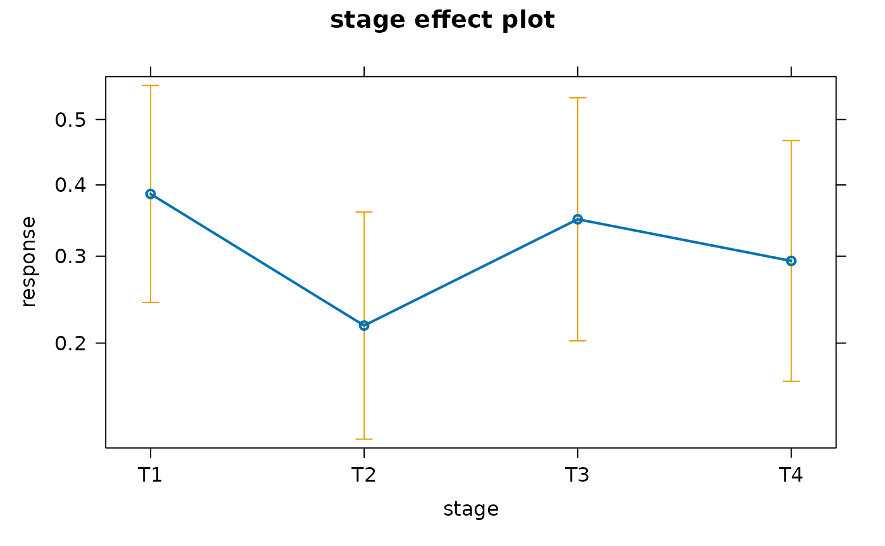

To understand what are the “typical values” used by
[`effects::Effect()`](https://rdrr.io/pkg/effects/man/effect.html),
let’s have a look at the model matrix generated by the package and used
for predictions.

``` r
e$model.matrix
#>   (Intercept) trtDrug B    marker stageT2 stageT3 stageT4 poly(age, 2)1
#> 1           1 0.5202312 0.9191792       0       0       0 -2.228704e-16
#> 2           1 0.5202312 0.9191792       1       0       0 -2.228704e-16
#> 3           1 0.5202312 0.9191792       0       1       0 -2.228704e-16
#> 4           1 0.5202312 0.9191792       0       0       1 -2.228704e-16
#>   poly(age, 2)2 trtDrug B:marker
#> 1   -0.05568232        0.4781857
#> 2   -0.05568232        0.4781857
#> 3   -0.05568232        0.4781857
#> 4   -0.05568232        0.4781857
#> attr(,"assign")
#> [1] 0 1 2 3 3 3 4 4 5
#> attr(,"contrasts")
#> attr(,"contrasts")$trt
#> [1] "contr.treatment"
#> 
#> attr(,"contrasts")$stage
#> [1] "contr.treatment"
```

The other continuous regressors are set to their observed mean while the
other categorical regressors are weighted according to their observed
proportions. Somehow, an artificial “averaged” individual is created, of
mean age and mean marker level, and being partly receiving Drug A and
Drug B. And then, we predict the probability of `response` if this
individual would be in stage T1, T2, T3 or T4.

For a continuous variable,
[`effects::Effect()`](https://rdrr.io/pkg/effects/man/effect.html) will
consider several values of the regressor (based on the range of observed
values) to estimate marginal predictions at these different values.

``` r
e2 <- Effect("age", mod)
e2
#> 
#>  age effect
#> age
#>         6        30        40        60        80 
#> 0.1664397 0.2392447 0.2760557 0.3606351 0.4568567
plot(e2)
```


The
[`effects::allEffects()`](https://rdrr.io/pkg/effects/man/effect.html)
will build all marginal predictions of all regressors, taking into
account eventual interactions within the model.

``` r
allEffects(mod)
#>  model: response ~ trt * marker + stage + poly(age, 2)
#> 
#>  stage effect
#> stage
#>        T1        T2        T3        T4 
#> 0.3866154 0.2179846 0.3501056 0.2938566 
#> 
#>  age effect
#> age
#>         6        30        40        60        80 
#> 0.1664397 0.2392447 0.2760557 0.3606351 0.4568567 
#> 
#>  trt*marker effect
#>         marker
#> trt          0.005         1         2         3         4
#>   Drug A 0.2338204 0.2776269 0.3264017 0.3792467 0.4351208
#>   Drug B 0.2479065 0.3408371 0.4484189 0.5610548 0.6677329
plot(allEffects(mod))
```

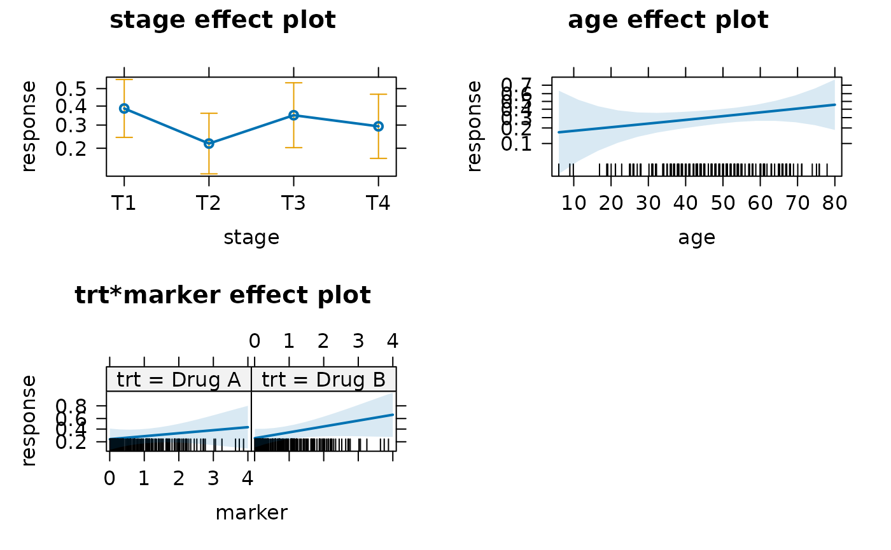

It is also possible to generate similar plots with
[`ggeffects::ggeffect()`](https://strengejacke.github.io/ggeffects/reference/ggpredict.html).
Please note that
[`ggeffects::ggeffect()`](https://strengejacke.github.io/ggeffects/reference/ggpredict.html)
will consider, by default, only individual variables from the model and
not existing interactions.

``` r
mod |>
  ggeffects::ggeffect() |>
  lapply(plot) |>
  patchwork::wrap_plots()
```

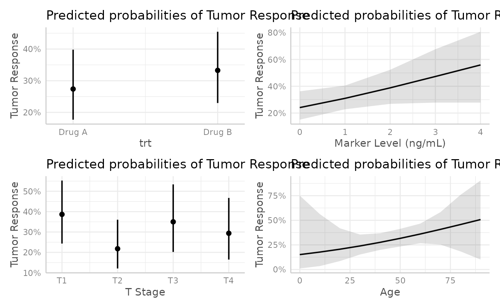

To generate a tibble of these results formatted in a way that it could
be use with
[`tidy_plus_plus()`](https://larmarange.github.io/broom.helpers/dev/reference/tidy_plus_plus.md)
and other [broom.helpers](https://larmarange.github.io/broom.helpers/)’s
`tidy_*()` helpers,
[broom.helpers](https://larmarange.github.io/broom.helpers/) provides a
[`tidy_all_effects()`](https://larmarange.github.io/broom.helpers/dev/reference/tidy_all_effects.md)
tieder.

``` r
tidy_all_effects(mod)
#>       variable         term  estimate  std.error   conf.low conf.high
#> 1        stage           T1 0.3866154 0.08138561 0.24338626 0.5525749
#> 2        stage           T2 0.2179846 0.06122617 0.12116925 0.3604304
#> 3        stage           T3 0.3501056 0.08749758 0.20225147 0.5337316
#> 4        stage           T4 0.2938566 0.07895328 0.16486445 0.4673012
#> 5  poly(age,2)            6 0.1664397 0.15368239 0.02226625 0.6364570
#> 6  poly(age,2)           30 0.2392447 0.05197357 0.15232129 0.3549982
#> 7  poly(age,2)           40 0.2760557 0.04346297 0.19934983 0.3686854
#> 8  poly(age,2)           60 0.3606351 0.05152656 0.26686307 0.4663957
#> 9  poly(age,2)           80 0.4568567 0.16663622 0.18404077 0.7582667
#> 10  trt:marker Drug A:0.005 0.2338204 0.07478345 0.11867604 0.4088555
#> 11  trt:marker Drug B:0.005 0.2479065 0.06818623 0.13864532 0.4029880
#> 12  trt:marker     Drug A:1 0.2776269 0.05673207 0.18083471 0.4008740
#> 13  trt:marker     Drug B:1 0.3408371 0.05901662 0.23605720 0.4638846
#> 14  trt:marker     Drug A:2 0.3264017 0.08136674 0.19002540 0.5002087
#> 15  trt:marker     Drug B:2 0.4484189 0.09615134 0.27508336 0.6352624
#> 16  trt:marker     Drug A:3 0.3792467 0.13846045 0.16171930 0.6592599
#> 17  trt:marker     Drug B:3 0.5610548 0.15197028 0.27607502 0.8107519
#> 18  trt:marker     Drug A:4 0.4351208 0.20665349 0.12910815 0.8000955
#> 19  trt:marker     Drug B:4 0.6677329 0.19316496 0.26727889 0.9171600
```

It is therefore very easy to produce a nicely formatted table with
[`gtsummary::tbl_regression()`](https://www.danieldsjoberg.com/gtsummary/reference/tbl_regression.html)
or a forest plot with
[`ggstats::ggcoef_model()`](https://larmarange.github.io/ggstats/reference/ggcoef_model.html).

``` r
mod |>
  tbl_regression(
    tidy_fun = tidy_all_effects,
    estimate_fun = scales::label_percent(accuracy = .1)
  ) |>
  bold_labels()
```

[TABLE]

``` r
ggstats::ggcoef_model(
  mod,
  tidy_fun = tidy_all_effects,
  vline = FALSE
)
```

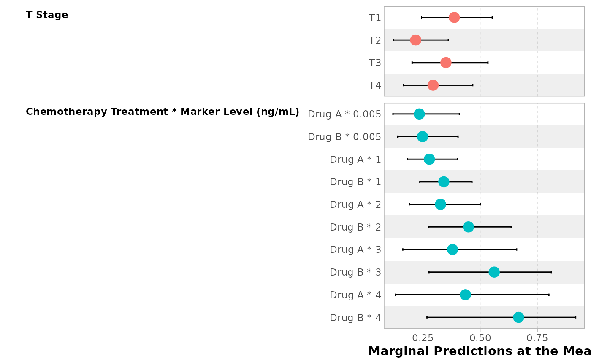

#### the `{marginaleffects}`’s approach at the Mean

The [marginaleffects](https://marginaleffects.com/) package allows to
compute marginal predictions “at the mean”, i.e. by considering the mean
of the other continuous regressors and the mode (i.e. the most frequent
observed modality) of categorical regressors. For that, we should call
[`marginaleffects::predictions()`](https://rdrr.io/pkg/marginaleffects/man/predictions.html)
with `newdata = "mean"`.

``` r
library(marginaleffects)
predictions(
  mod,
  variables = "stage",
  newdata = "mean",
  by = "stage"
)
#> 
#>  stage Estimate Std. Error    z Pr(>|z|)    S 2.5 % 97.5 %
#>     T1    0.419     0.0930 4.51   <0.001 17.2 0.237  0.602
#>     T2    0.242     0.0702 3.45   <0.001 10.8 0.104  0.380
#>     T3    0.382     0.0977 3.90   <0.001 13.4 0.190  0.573
#>     T4    0.323     0.0893 3.62   <0.001 11.7 0.148  0.498
#> 
#> Type: response
```

Four “mean individuals” were generated, with just the value of `stage`
being different from one individual to the other, before predicting the
probability of `response`.

For a continuous variable, predictions will be made, by default, at
Tukey’s five numbers, i.e. the minimum, the first quartile, the median,
the third quartile and the maximum.

``` r
predictions(
  mod,
  variables = "age",
  newdata = "mean",
  by = "age"
)
#> 
#>  age Estimate Std. Error     z Pr(>|z|)    S   2.5 % 97.5 %
#>    6    0.127     0.1325 0.961  0.33665  1.6 -0.1324  0.387
#>   37    0.208     0.0659 3.159  0.00158  9.3  0.0790  0.337
#>   47    0.242     0.0702 3.446  < 0.001 10.8  0.1044  0.380
#>   57    0.280     0.0771 3.629  < 0.001 11.8  0.1287  0.431
#>   83    0.395     0.2104 1.878  0.06043  4.0 -0.0173  0.807
#> 
#> Type: response
```

[broom.helpers](https://larmarange.github.io/broom.helpers/) provides a
global tidier
[`tidy_marginal_predictions()`](https://larmarange.github.io/broom.helpers/dev/reference/tidy_marginal_predictions.md)
to compute the marginal predictions for each variable or combination of
variables before stacking them in a unique tibble. You should specify
`newdata = "mean"` to get marginal predictions at the mean. By default,
as
[`effects::allEffects()`](https://rdrr.io/pkg/effects/man/effect.html),
it will consider all higher order combinations of variables (as
identified with
[`model_list_higher_order_variables()`](https://larmarange.github.io/broom.helpers/dev/reference/model_list_higher_order_variables.md)).

``` r
mod |>
  model_list_higher_order_variables()
#> [1] "stage"      "age"        "trt:marker"
mod |>
  tbl_regression(
    tidy_fun = tidy_marginal_predictions,
    newdata = "mean",
    estimate_fun = scales::label_percent(accuracy = .1),
    label = list(age = "Age in years")
  ) |>
  modify_column_hide("p.value") |>
  bold_labels()
```

[TABLE]

Simply specify `variables_list = "no_interaction"` to compute marginal
predictions for each individual variable without considering existing
interactions.

``` r
mod |>
  tbl_regression(
    tidy_fun = tidy_marginal_predictions,
    variables_list = "no_interaction",
    newdata = "mean",
    estimate_fun = scales::label_percent(accuracy = .1),
    label = list(age = "Age in years")
  ) |>
  modify_column_hide("p.value") |>
  bold_labels()
```

[TABLE]

[broom.helpers](https://larmarange.github.io/broom.helpers/) also
include
[`plot_marginal_predictions()`](https://larmarange.github.io/broom.helpers/dev/reference/tidy_marginal_predictions.md)
to generate a list of plots to visualize all marginal predictions. Use
[`patchwork::wrap_plots()`](https://patchwork.data-imaginist.com/reference/wrap_plots.html)
to combine all plots together.

``` r
p <- mod |>
  plot_marginal_predictions(newdata = "mean") |>
  patchwork::wrap_plots() &
  ggplot2::scale_y_continuous(
    labels = scales::label_percent(),
    limits = c(-0.2, 1)
  )
p[[2]] <- p[[2]] + ggplot2::xlab("Age in years")
p + patchwork::plot_annotation(
  title = "Marginal Predictions at the Mean"
)
```

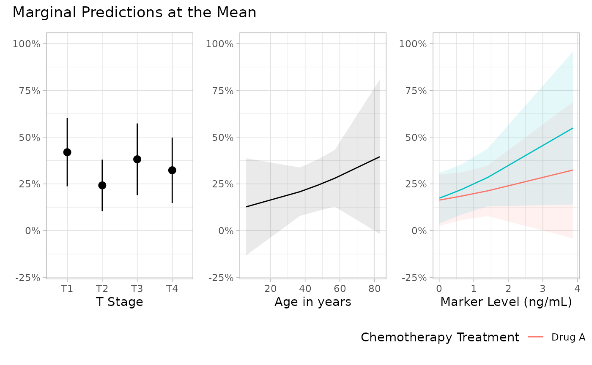

``` r
p <- mod |>
  plot_marginal_predictions(
    "no_interaction",
    newdata = "mean"
  ) |>
  patchwork::wrap_plots() &
  ggplot2::scale_y_continuous(
    labels = scales::label_percent(),
    limits = c(-0.2, 1)
  )
p[[4]] <- p[[4]] + ggplot2::xlab("Age in years")
p + patchwork::plot_annotation(
  title = "Marginal Predictions at the Mean"
)
```

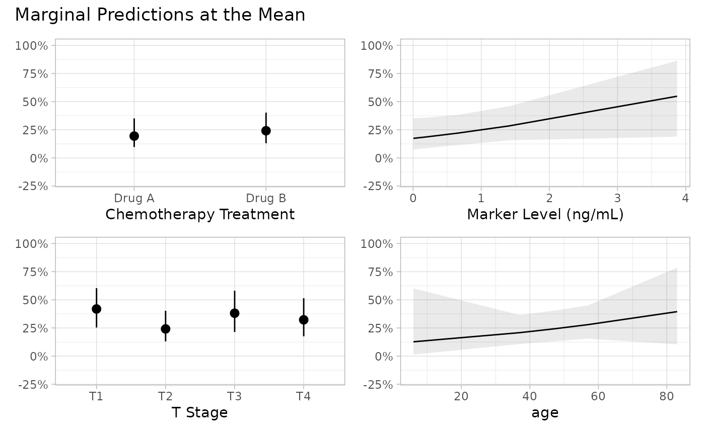

Alternatively, you can use
[`ggstats::ggcoef_model()`](https://larmarange.github.io/ggstats/reference/ggcoef_model.html),
using `tidy_args` to pass arguments to
[`broom.helpers::tidy_marginal_predictions()`](https://larmarange.github.io/broom.helpers/dev/reference/tidy_marginal_predictions.md).

``` r
ggstats::ggcoef_model(
  mod,
  tidy_fun = tidy_marginal_predictions,
  tidy_args = list(newdata = "mean", variables_list = "no_interaction"),
  vline = FALSE,
  show_p_values = FALSE,
  signif_stars = FALSE,
  significance = NULL,
  variable_labels = c(age = "Age in years")
)
```

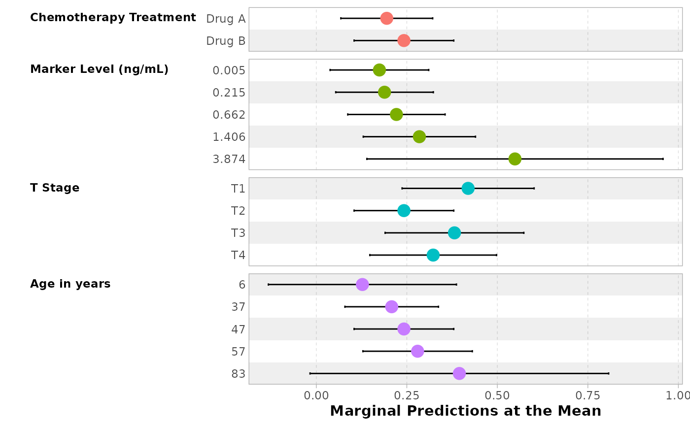

### Average Marginal Predictions

Instead of averaging observed values to generate “typical observations”
before predicting the outcome, an alternative consists to predict the
outcome on the overall observed values before averaging the results.

More precisely, the purpose is to adopt a counterfactual approach. Let’s
take an example. Let’s consider `d` our observed data used to estimate
the model. We can make a copy of this dataset, where all variables would
be identical, but considering that all individuals have received Drug A.
Similarly, we could generate a dataset where all individuals would have
received Drug B.

``` r
dA <- d |>
  mutate(trt = "Drug A")
dB <- d |>
  mutate(trt = "Drug B")
```

We can now predict the outcome for all observations in `dA` and then
compute the average, and similarly with `dB`.

``` r
predict(mod, newdata = dA, type = "response") |> mean()
#> [1] 0.2830866
predict(mod, newdata = dB, type = "response") |> mean()
#> [1] 0.3431492
```

We, then, obtain **Average Marginal Predictions** for `trt`. The same
results could be computed with
[`marginaleffects::avg_predictions()`](https://rdrr.io/pkg/marginaleffects/man/predictions.html).
Note that the counterfactual approach corresponds to the default
behavior when no value is provided to `newdata`.

``` r
avg_predictions(mod, variables = "trt", by = "trt", type = "response")
#> 
#>     trt Estimate Std. Error    z Pr(>|z|)    S 2.5 % 97.5 %
#>  Drug A    0.282     0.0486 5.79   <0.001 27.1 0.186  0.377
#>  Drug B    0.342     0.0493 6.93   <0.001 37.8 0.245  0.439
#> 
#> Type: response
```

**Important:** since version 0.10.0 of `marginaleffects`, we had to add
`type = "response"` to get this result: for `glm` models, predictions
are done on the response scale, before being averaged. If `type` are not
specified, predictions will be made on the link scale, before being
averaged and then back transformed on the response scale. Thus, the
average prediction may not be exactly identical to the average of
predictions.

``` r
avg_predictions(mod, variables = "trt", by = "trt")
#> 
#>     trt Estimate Std. Error    z Pr(>|z|)    S 2.5 % 97.5 %
#>  Drug A    0.282     0.0486 5.79   <0.001 27.1 0.186  0.377
#>  Drug B    0.342     0.0493 6.93   <0.001 37.8 0.245  0.439
#> 
#> Type: response
b <- binomial()
predict(mod, newdata = dA, type = "link") |>
  mean() |>
  b$linkinv()
#> [1] 0.2743123
predict(mod, newdata = dB, type = "link") |>
  mean() |>
  b$linkinv()
#> [1] 0.3331447
```

We can use
[`tidy_marginal_predictions()`](https://larmarange.github.io/broom.helpers/dev/reference/tidy_marginal_predictions.md)
to get average marginal predictions for all variables and
[`plot_marginal_predictions()`](https://larmarange.github.io/broom.helpers/dev/reference/tidy_marginal_predictions.md)
for a visual representation.

``` r
mod |>
  tbl_regression(
    tidy_fun = tidy_marginal_predictions,
    type = "response",
    variables_list = "no_interaction",
    estimate_fun = scales::label_percent(accuracy = .1),
    label = list(age = "Age in years")
  ) |>
  modify_column_hide("p.value") |>
  bold_labels()
```

[TABLE]

``` r
mod |>
  tbl_regression(
    tidy_fun = tidy_marginal_predictions,
    type = "response",
    estimate_fun = scales::label_percent(accuracy = .1),
    label = list(age = "Age in years")
  ) |>
  modify_column_hide("p.value") |>
  bold_labels()
```

[TABLE]

``` r
p <- plot_marginal_predictions(mod, type = "response") |>
  patchwork::wrap_plots(ncol = 2) &
  ggplot2::scale_y_continuous(
    labels = scales::label_percent(),
    limits = c(-0.2, 1)
  )
p[[2]] <- p[[2]] + ggplot2::xlab("Age in years")
p + patchwork::plot_annotation(
  title = "Average Marginal Predictions"
)
#> Warning: Removed 1 row containing missing values or values outside the scale range
#> (`geom_ribbon()`).
```

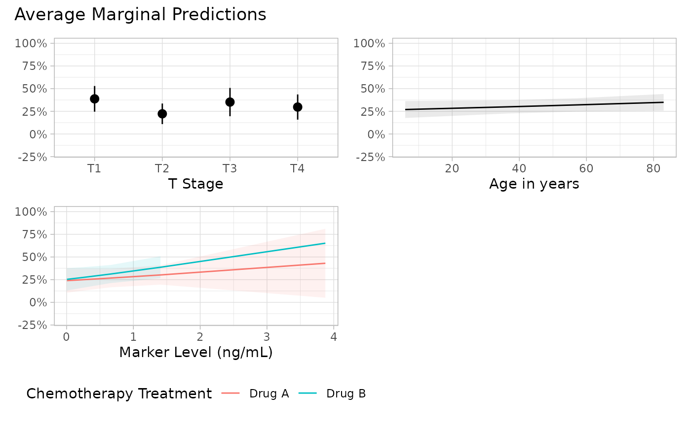

### Marginal Means and Marginal Predictions at Marginal Means

The [emmeans](https://rvlenth.github.io/emmeans/) package adopted, by
default, another approach based on **marginal means** or *estimated
marginal means* (a.k.a. emmeans).

It will consider a grid of predictors with all combinations of the
observed modalities of the categorical variables and fixing continuous
variables at their means.

Let’s call
[`marginaleffects::predictions()`](https://rdrr.io/pkg/marginaleffects/man/predictions.html)
with `newdata = "balanced"`.

``` r
pred <- predictions(mod, newdata = "balanced")
pred |> dplyr::as_tibble()
#> # A tibble: 8 × 11
#>   rowid estimate  p.value s.value conf.low conf.high   age marker stage trt   
#>   <int>    <dbl>    <dbl>   <dbl>    <dbl>     <dbl> <int>  <dbl> <fct> <chr> 
#> 1     1    0.353 0.116       3.11   0.205      0.537    47  0.919 T1    Drug A
#> 2     2    0.419 0.394       1.34   0.254      0.604    47  0.919 T1    Drug B
#> 3     3    0.195 0.000581   10.7    0.0971     0.352    47  0.919 T2    Drug A
#> 4     4    0.242 0.00286     8.45   0.131      0.403    47  0.919 T2    Drug B
#> 5     5    0.318 0.0747      3.74   0.168      0.519    47  0.919 T3    Drug A
#> 6     6    0.382 0.244       2.04   0.215      0.582    47  0.919 T3    Drug B
#> 7     7    0.265 0.0167      5.90   0.135      0.454    47  0.919 T4    Drug A
#> 8     8    0.323 0.0696      3.84   0.176      0.515    47  0.919 T4    Drug B
#> # ℹ 1 more variable: df <dbl>
```

As we can see, `pred` contains 8 rows, one for each combination of `trt`
(2 modalities) and `stage` (4 modalities). `age` is fixed at its mean
(`mean(d$age)`) as well as `marker`.

Let’s compute the average predictions for each value of `stage`.

``` r
pred |>
  group_by(stage) |>
  summarise(mean(estimate))
#> # A tibble: 4 × 2
#>   stage `mean(estimate)`
#>   <fct>            <dbl>
#> 1 T1               0.386
#> 2 T2               0.218
#> 3 T3               0.350
#> 4 T4               0.294
```

We can check that we obtain the same estimates as with
[`emmeans::emmeans()`](https://rvlenth.github.io/emmeans/reference/emmeans.html).

``` r
emmeans::emmeans(mod, "stage", type = "response")
#>  stage  prob     SE  df asymp.LCL asymp.UCL
#>  T1    0.385 0.0813 Inf     0.242     0.551
#>  T2    0.217 0.0611 Inf     0.120     0.359
#>  T3    0.349 0.0874 Inf     0.201     0.532
#>  T4    0.293 0.0788 Inf     0.164     0.466
#> 
#> Results are averaged over the levels of: trt 
#> Confidence level used: 0.95 
#> Intervals are back-transformed from the logit scale
```

These estimates could be computed, for each categorical variable, with
`marginaleffects::prediction()` using
`datagrid(grid_type = "balanced")`[¹](#fn1).

``` r
predictions(mod,
  by = "trt",
  newdata = datagrid(grid_type = "balanced")
)
#> 
#>     trt Estimate Std. Error    z Pr(>|z|)    S 2.5 % 97.5 %
#>  Drug A    0.283     0.0572 4.94   <0.001 20.3 0.171  0.395
#>  Drug B    0.341     0.0584 5.85   <0.001 27.6 0.227  0.456
#> 
#> Type: response
predictions(mod,
  by = "stage",
  newdata = datagrid(grid_type = "balanced")
)
#> 
#>  stage Estimate Std. Error    z Pr(>|z|)    S  2.5 % 97.5 %
#>     T1    0.386     0.0810 4.77   <0.001 19.0 0.2275  0.545
#>     T2    0.218     0.0610 3.58   <0.001 11.5 0.0987  0.338
#>     T3    0.350     0.0871 4.02   <0.001 14.1 0.1793  0.521
#>     T4    0.294     0.0786 3.74   <0.001 12.4 0.1398  0.448
#> 
#> Type: response
```

Marginal means are defined only for categorical variables. However, we
can define **marginal predictions at marginal means** for both
continuous and categorical variables, calling
[`tidy_marginal_predictions()`](https://larmarange.github.io/broom.helpers/dev/reference/tidy_marginal_predictions.md)
with the option `newdata = "balanced"`. For categorical variables,
marginal predictions at marginal means will be equal to marginal means.

``` r
mod |>
  tbl_regression(
    tidy_fun = tidy_marginal_predictions,
    newdata = "balanced",
    variables_list = "no_interaction",
    estimate_fun = scales::label_percent(accuracy = .1),
    label = list(age = "Age in years")
  ) |>
  modify_column_hide("p.value") |>
  bold_labels()
```

[TABLE]

### Alternative approaches

#### Marginal Predictions at the Median

They are similar to marginal predictions at the mean, except that
continuous variables are fixed at the median of observed values (and
categorical variables at their mode). Simply use `newdata = "median"`.

``` r
mod |>
  tbl_regression(
    tidy_fun = tidy_marginal_predictions,
    newdata = "median",
    variables_list = "no_interaction",
    estimate_fun = scales::label_percent(accuracy = .1),
    label = list(age = "Age in years")
  ) |>
  modify_column_hide("p.value") |>
  bold_labels()
```

[TABLE]

#### the `ggeffects::ggpredict()`’s approach

The [ggeffects](https://strengejacke.github.io/ggeffects/) package
offers a
[`ggeffects::ggpredict()`](https://strengejacke.github.io/ggeffects/reference/ggpredict.html)
function which generates marginal predictions at the mean of continuous
variables and at the first modality (used as reference) of categorical
variables. [broom.helpers](https://larmarange.github.io/broom.helpers/)
provides a
[`tidy_ggpredict()`](https://larmarange.github.io/broom.helpers/dev/reference/tidy_ggpredict.md)
tidier.

``` r
mod |>
  tbl_regression(
    tidy_fun = tidy_ggpredict,
    estimate_fun = scales::label_percent(accuracy = .1),
    label = list(age = "Age in years")
  ) |>
  bold_labels()
#> Some of the focal terms are of type `character`. This may lead to
#>   unexpected results. It is recommended to convert these variables to
#>   factors before fitting the model.
#>   The following variables are of type character: `trt`
```

[TABLE]

``` r
mod |>
  ggeffects::ggpredict() |>
  plot() |>
  patchwork::wrap_plots()
#> Some of the focal terms are of type `character`. This may lead to
#>   unexpected results. It is recommended to convert these variables to
#>   factors before fitting the model.
#>   The following variables are of type character: `trt`
```

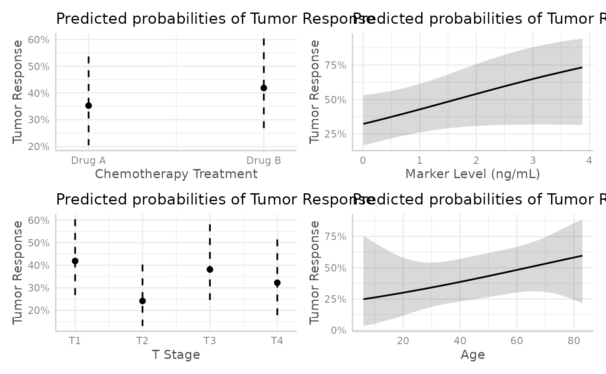

## Marginal Contrasts

Now that we have a way to estimate marginal predictions, we can easily
compute **marginal contrasts**, i.e. difference between marginal
predictions.

### Average Marginal Contrasts

Let’s consider first a categorical variable, e.g. `stage`. Average
Marginal Predictions are obtained with
[`marginaleffects::avg_predictions()`](https://rdrr.io/pkg/marginaleffects/man/predictions.html).

``` r
pred <- avg_predictions(mod, variables = "stage", by = "stage", type = "response")
pred
#> 
#>  stage Estimate Std. Error    z Pr(>|z|)    S 2.5 % 97.5 %
#>     T1    0.387     0.0723 5.36   <0.001 23.5 0.246  0.529
#>     T2    0.223     0.0579 3.85   <0.001 13.0 0.109  0.336
#>     T3    0.352     0.0795 4.43   <0.001 16.7 0.196  0.508
#>     T4    0.297     0.0709 4.19   <0.001 15.2 0.158  0.436
#> 
#> Type: response
```

The contrast between `"T2"` and `"T1"` is simply the difference between
the two adjusted predictions:

``` r
pred$estimate[2] - pred$estimate[1]
#> [1] -0.1648346
```

The
[`marginaleffects::avg_comparisons()`](https://rdrr.io/pkg/marginaleffects/man/comparisons.html)
function allows to compute all differences between adjusted predictions.

``` r
comp <- avg_comparisons(mod, variables = "stage")
comp
#> 
#>  Contrast Estimate Std. Error      z Pr(>|z|)   S  2.5 % 97.5 %
#>   T2 - T1  -0.1638     0.0925 -1.770   0.0767 3.7 -0.345 0.0175
#>   T3 - T1  -0.0351     0.1065 -0.330   0.7417 0.4 -0.244 0.1736
#>   T4 - T1  -0.0895     0.1004 -0.891   0.3727 1.4 -0.286 0.1073
#> 
#> Term: stage
#> Type: response
```

*Note:* in fact,
[`avg_comparisons()`](https://rdrr.io/pkg/marginaleffects/man/comparisons.html)
has computed the contrasts for each observed values before averaging it.
By construction, it is equivalent to the difference of the average
marginal predictions.

As the contrast has been averaged over the observed values, we can call
them **average marginal contrast**.

By default, each modality is contrasted with the first one taken as a
reference.

``` r
avg_comparisons(mod, variables = "stage")
#> 
#>  Contrast Estimate Std. Error      z Pr(>|z|)   S  2.5 % 97.5 %
#>   T2 - T1  -0.1638     0.0925 -1.770   0.0767 3.7 -0.345 0.0175
#>   T3 - T1  -0.0351     0.1065 -0.330   0.7417 0.4 -0.244 0.1736
#>   T4 - T1  -0.0895     0.1004 -0.891   0.3727 1.4 -0.286 0.1073
#> 
#> Term: stage
#> Type: response
```

Other types of contrasts could be specified using the `variables`
argument.

``` r
avg_comparisons(mod, variables = list(stage = "sequential"))
#> 
#>  Contrast Estimate Std. Error      z Pr(>|z|)   S   2.5 % 97.5 %
#>   T2 - T1  -0.1638     0.0925 -1.770   0.0767 3.7 -0.3451 0.0175
#>   T3 - T2   0.1287     0.0972  1.324   0.1856 2.4 -0.0619 0.3192
#>   T4 - T3  -0.0544     0.1060 -0.513   0.6081 0.7 -0.2622 0.1535
#> 
#> Term: stage
#> Type: response
avg_comparisons(mod, variables = list(stage = "pairwise"))
#> 
#>  Contrast Estimate Std. Error      z Pr(>|z|)   S   2.5 % 97.5 %
#>   T2 - T1  -0.1638     0.0925 -1.770   0.0767 3.7 -0.3451 0.0175
#>   T3 - T1  -0.0351     0.1065 -0.330   0.7417 0.4 -0.2437 0.1736
#>   T3 - T2   0.1287     0.0972  1.324   0.1856 2.4 -0.0619 0.3192
#>   T4 - T1  -0.0895     0.1004 -0.891   0.3727 1.4 -0.2862 0.1073
#>   T4 - T2   0.0743     0.0917  0.811   0.4176 1.3 -0.1054 0.2540
#>   T4 - T3  -0.0544     0.1060 -0.513   0.6081 0.7 -0.2622 0.1535
#> 
#> Term: stage
#> Type: response
```

Let’s consider a continuous variable:

``` r
avg_comparisons(mod, variables = "age")
#> 
#>  Estimate Std. Error  z Pr(>|z|)  S 2.5 % 97.5 %
#>         0         NA NA       NA NA    NA     NA
#> 
#> Term: age
#> Type: response
#> Comparison: +1
```

By default,
[`marginaleffects::avg_comparisons()`](https://rdrr.io/pkg/marginaleffects/man/comparisons.html)
computes, for each observed value, the effect of increasing `age` by one
unit (comparing adjusted predictions when the regressor is equal to its
observed value minus 0.5 and its observed value plus 0.5). It is
possible to compute a contrast for another gap, for example the average
difference for an increase of 10 years:

``` r
avg_comparisons(mod, variables = list(age = 10))
#> 
#>  Estimate Std. Error  z Pr(>|z|)  S 2.5 % 97.5 %
#>         0         NA NA       NA NA    NA     NA
#> 
#> Term: age
#> Type: response
#> Comparison: +10
```

Contrasts for all individual predictors could be easily obtained:

``` r
avg_comparisons(mod)
#> 
#>    Term        Contrast Estimate Std. Error      z Pr(>|z|)   S     2.5 %
#>  age    +1               0.00136   0.000826  1.651   0.0987 3.3 -0.000255
#>  marker +1               0.07525   0.042004  1.791   0.0732 3.8 -0.007078
#>  stage  T2 - T1         -0.16517   0.093213 -1.772   0.0764 3.7 -0.347865
#>  stage  T3 - T1         -0.03580   0.107722 -0.332   0.7396 0.4 -0.246928
#>  stage  T4 - T1         -0.09064   0.101313 -0.895   0.3710 1.4 -0.289212
#>  trt    Drug B - Drug A  0.06033   0.069547  0.868   0.3857 1.4 -0.075977
#>   97.5 %
#>  0.00298
#>  0.15758
#>  0.01752
#>  0.17533
#>  0.10793
#>  0.19664
#> 
#> Type: response
```

It should be noted that column names are not consistent with other
tidiers used by `broom.helpers`. Therefore, a `comparisons` object
should not be passed directly to
[`tidy_plus_plus()`](https://larmarange.github.io/broom.helpers/dev/reference/tidy_plus_plus.md).
Instead, you should use
[`broom.helpers::tidy_avg_comparisons()`](https://larmarange.github.io/broom.helpers/dev/reference/tidy_avg_comparisons.md).

``` r
tidy_avg_comparisons(mod)
#> # A tibble: 6 × 9
#>   variable term  estimate std.error statistic p.value s.value conf.low conf.high
#>   <chr>    <chr>    <dbl>     <dbl>     <dbl>   <dbl>   <dbl>    <dbl>     <dbl>
#> 1 age      +1     0.00136  0.000826     1.65   0.0987   3.34  -2.55e-4   0.00298
#> 2 marker   +1     0.0752   0.0420       1.79   0.0732   3.77  -7.08e-3   0.158  
#> 3 stage    T2 -… -0.165    0.0932      -1.77   0.0764   3.71  -3.48e-1   0.0175 
#> 4 stage    T3 -… -0.0358   0.108       -0.332  0.740    0.435 -2.47e-1   0.175  
#> 5 stage    T4 -… -0.0906   0.101       -0.895  0.371    1.43  -2.89e-1   0.108  
#> 6 trt      Drug…  0.0603   0.0695       0.868  0.386    1.37  -7.60e-2   0.197
```

This custom tidier is compatible with
[`tidy_plus_plus()`](https://larmarange.github.io/broom.helpers/dev/reference/tidy_plus_plus.md)
and the suit of other functions provided by
[broom.helpers](https://larmarange.github.io/broom.helpers/).

``` r
mod |>
  tidy_plus_plus(tidy_fun = tidy_avg_comparisons)
#> # A tibble: 6 × 20
#>   term            variable var_label    var_class var_type var_nlevels contrasts
#>   <chr>           <chr>    <chr>        <chr>     <chr>          <int> <chr>    
#> 1 +1              age      age          nmatrix.2 continu…          NA NA       
#> 2 +1              marker   Marker Leve… numeric   continu…          NA NA       
#> 3 T2 - T1         stage    T Stage      factor    categor…           4 contr.tr…
#> 4 T3 - T1         stage    T Stage      factor    categor…           4 contr.tr…
#> 5 T4 - T1         stage    T Stage      factor    categor…           4 contr.tr…
#> 6 Drug B - Drug A trt      Chemotherap… character dichoto…           2 contr.tr…
#> # ℹ 13 more variables: contrasts_type <chr>, reference_row <lgl>, label <chr>,
#> #   n_obs <dbl>, n_event <dbl>, estimate <dbl>, std.error <dbl>,
#> #   statistic <dbl>, p.value <dbl>, s.value <dbl>, conf.low <dbl>,
#> #   conf.high <dbl>, label_attr <chr>
```

A nicely formatted table can therefore be generated with
[`gtsummary::tbl_regression()`](https://www.danieldsjoberg.com/gtsummary/reference/tbl_regression.html).

``` r
mod |>
  tbl_regression(
    tidy_fun = tidy_avg_comparisons,
    estimate_fun = scales::label_percent(style_positive = "plus"),
    label = list(age = "Age in years")
  ) |>
  bold_labels()
```

[TABLE]

Similarly, a forest plot could be produced with
[`ggstats::ggcoef_model()`](https://larmarange.github.io/ggstats/reference/ggcoef_model.html).

``` r
ggstats::ggcoef_model(
  mod,
  tidy_fun = tidy_avg_comparisons,
  variable_labels = c(age = "Age in years")
) +
  ggplot2::scale_x_continuous(
    labels = scales::label_percent(style_positive = "plus")
  )
#> Scale for x is already present.
#> Adding another scale for x, which will replace the existing scale.
```

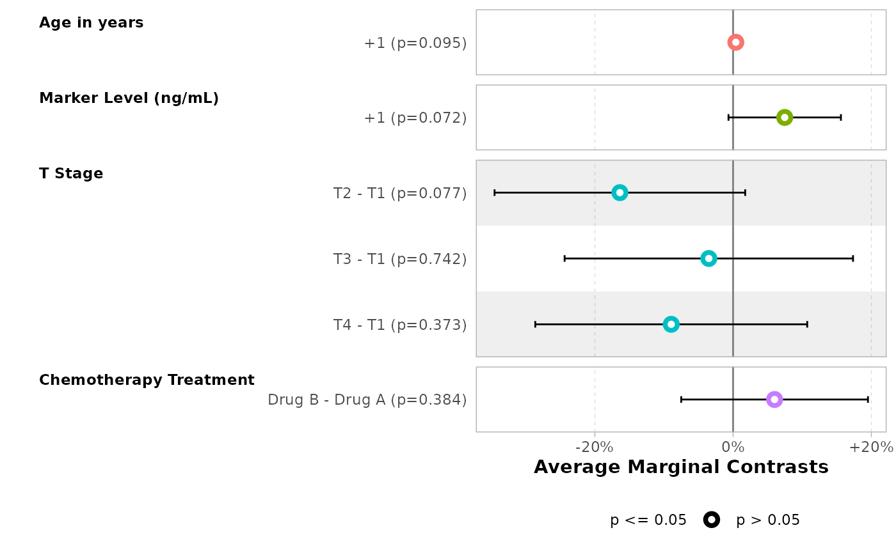

### Marginal Contrasts at the Mean

Instead of computing contrasts for each observed values before
averaging, another approach consist of considering an hypothetical
individual whose characteristics correspond to the “average” before
predicting results and computing contrasts.

It could be achieved with
[marginaleffects](https://marginaleffects.com/) by using
`newdata = "mean"`. In that case, it will consider an individual where
continuous predictors are equal to the mean of observed values and where
categorical predictors will be set to the mode (i.e. most frequent
value) of the observed values.

``` r
pred <- predictions(mod, variables = "trt", newdata = "mean")
pred
#> 
#>  Estimate Pr(>|z|)    S  2.5 % 97.5 %
#>     0.195  < 0.001 10.7 0.0971  0.352
#>     0.242  0.00286  8.5 0.1310  0.403
#> 
#> Type: invlink(link)
pred$estimate[2] - pred$estimate[1]
#> [1] 0.04743278
comparisons(mod, variables = "trt", newdata = "mean")
#> 
#>  Estimate Std. Error     z Pr(>|z|)   S   2.5 % 97.5 %
#>    0.0474     0.0579 0.819    0.413 1.3 -0.0661  0.161
#> 
#> Term: trt
#> Type: response
#> Comparison: Drug B - Drug A
```

The `newdata` argument can be passed to
[`tidy_avg_comparisons()`](https://larmarange.github.io/broom.helpers/dev/reference/tidy_avg_comparisons.md),
`tidy_plus_plus` or
[`gtsummary::tbl_regression()`](https://www.danieldsjoberg.com/gtsummary/reference/tbl_regression.html).

``` r
mod |>
  tbl_regression(
    tidy_fun = tidy_avg_comparisons,
    newdata = "mean",
    estimate_fun = scales::label_percent(style_positive = "plus"),
    label = list(age = "Age in years")
  ) |>
  bold_labels()
```

[TABLE]

For
[`ggstats::ggcoef_model()`](https://larmarange.github.io/ggstats/reference/ggcoef_model.html),
use `tidy_args` to pass `newdata = "mean"`.

``` r
mod |>
  ggstats::ggcoef_model(
    tidy_fun = tidy_avg_comparisons,
    tidy_args = list(newdata = "mean"),
    variable_labels = c(age = "Age in years")
  ) +
  ggplot2::scale_x_continuous(
    labels = scales::label_percent(style_positive = "plus")
  )
#> Scale for x is already present.
#> Adding another scale for x, which will replace the existing scale.
```

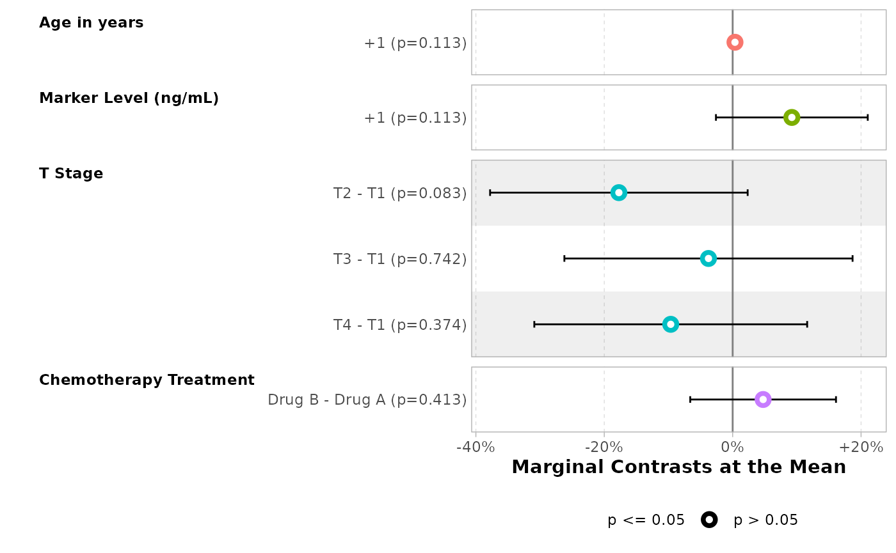

### Alternative approaches

Other assumptions, such as `"balanced"` or `"median"`, could be defined
using `newdata`. See the documentation of
[`marginaleffects::comparisons()`](https://rdrr.io/pkg/marginaleffects/man/comparisons.html).

``` r
mod |>
  tbl_regression(
    tidy_fun = tidy_avg_comparisons,
    newdata = "balanced",
    estimate_fun = scales::label_percent(style_positive = "plus"),
    label = list(age = "Age in years")
  ) |>
  bold_labels()
```

[TABLE]

``` r
mod |>
  ggstats::ggcoef_model(
    tidy_fun = tidy_avg_comparisons,
    tidy_args = list(newdata = "balanced"),
    variable_labels = c(age = "Age in years")
  ) +
  ggplot2::scale_x_continuous(
    labels = scales::label_percent(style_positive = "plus")
  )
#> Scale for x is already present.
#> Adding another scale for x, which will replace the existing scale.
```

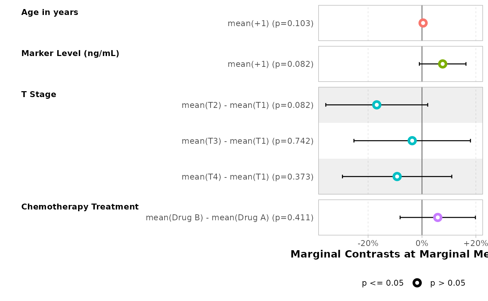

### Dealing with interactions

In our model, we defined an interaction between `trt` and `marker`.
Therefore, we could be interested to compute the contrast of `marker`
for each value of `trt`.

``` r
avg_comparisons(
  mod,
  variables = list(marker = 1),
  newdata = datagrid(
    trt = unique,
    grid_type = "counterfactual"
  ),
  by = "trt"
)
#> 
#>     trt Estimate Std. Error     z Pr(>|z|)   S   2.5 % 97.5 %
#>  Drug A   0.0474     0.0576 0.823   0.4104 1.3 -0.0655  0.160
#>  Drug B   0.1012     0.0595 1.701   0.0889 3.5 -0.0154  0.218
#> 
#> Term: marker
#> Type: response
#> Comparison: +1
```

Alternatively, it is possible to compute “cross-contrasts” showing what
is happening when both `marker` and `trt` are changing.

``` r
avg_comparisons(
  mod,
  variables = list(marker = 1, trt = "reference"),
  cross = TRUE
)
#> 
#>  C: marker          C: trt Estimate Std. Error    z Pr(>|z|)   S   2.5 % 97.5 %
#>         +1 Drug B - Drug A    0.161     0.0959 1.67   0.0941 3.4 -0.0274  0.348
#> 
#> Term: cross
#> Type: response
```

The tidier
[`tidy_marginal_contrasts()`](https://larmarange.github.io/broom.helpers/dev/reference/tidy_marginal_contrasts.md)
allows to compute directly several combinations of variables and to
stack all the results in a unique tibble.

``` r
mod |>
  tbl_regression(
    tidy_fun = tidy_marginal_contrasts,
    estimate_fun = scales::label_percent(style_positive = "plus"),
    label = list(age = "Age in years")
  ) |>
  bold_labels()
```

[TABLE]

``` r
ggstats::ggcoef_model(
  mod,
  tidy_fun = tidy_marginal_contrasts,
  variable_labels = c(age = "Age in years")
)
```

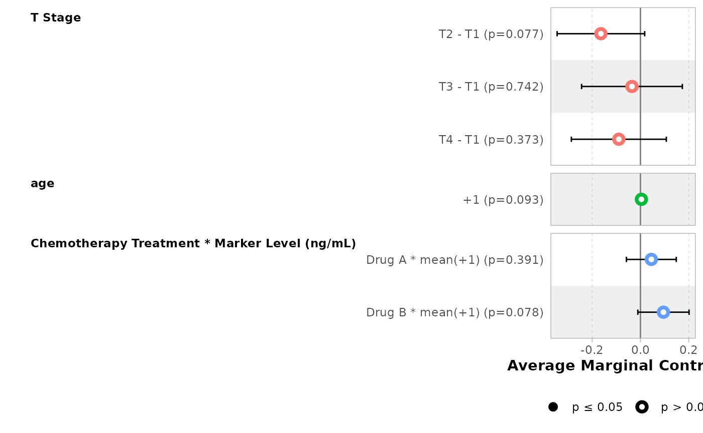

By default, when there is an interaction, contrasts are computed for the
last variable of the interaction according to the different values of
the first variables (if one of this variable is continuous, using
Tukey’s five numbers).

The option `variables_list = "cross"` could be used to get
“cross-contrasts” for interactions.

``` r
mod |>
  tbl_regression(
    tidy_fun = tidy_marginal_contrasts,
    variables_list = "cross",
    estimate_fun = scales::label_percent(style_positive = "plus"),
    label = list(age = "Age in years")
  ) |>
  bold_labels()
```

[TABLE]

The option `variables_list = "no_interaction"` could be used to get the
average marginal contrasts for each variable without considering
interactions.

``` r
mod |>
  tbl_regression(
    tidy_fun = tidy_marginal_contrasts,
    variables_list = "no_interaction",
    estimate_fun = scales::label_percent(style_positive = "plus"),
    label = list(age = "Age in years")
  ) |>
  bold_labels()
```

[TABLE]

``` r
ggstats::ggcoef_model(
  mod,
  tidy_fun = tidy_marginal_contrasts,
  tidy_args = list(variables_list = "no_interaction"),
  variable_labels = c(age = "Age in years")
)
```

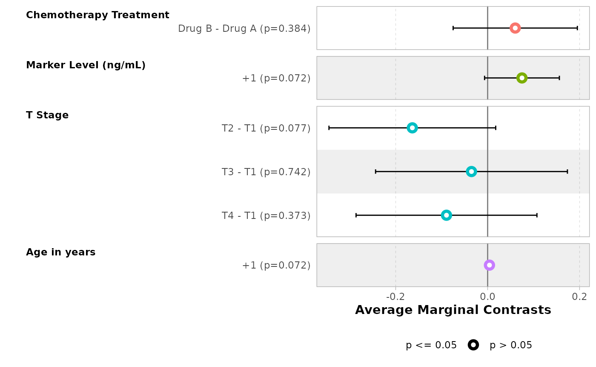

As before, to display marginal contrasts at the mean, indicate
`newdata = "mean"`. For more information on the way to customize the
combination of variables, see the documentation and examples of
[`tidy_marginal_contrasts()`](https://larmarange.github.io/broom.helpers/dev/reference/tidy_marginal_contrasts.md).

## Marginal Effects / Marginal Slopes

Marginal effects are similar to marginal contrasts with a subtle
difference. For a continuous regressor, a marginal contrast could be
seen as a difference while a marginal effect is a partial derivative.
Put differently, the marginal effect of a continuous regressor $x$ is
the **slope** of the prediction function $y$, measured at a specific
value of $x$, i.e. ${\partial y}/{\partial x}$.

Marginal effects are expressed according to the scale of the model and
represent the expected change on the outcome for an increase of one unit
of the regressor.

By definition, marginal effects are not defined for categorical
variables, marginal contrasts being reported instead.

Like marginal contrasts, several approaches exist to compute marginal
effects. For more details, see the [dedicated
vignette](https://vincentarelbundock.github.io/marginaleffects/articles/marginaleffects.html)
of the [marginaleffects](https://marginaleffects.com/) package.

### Average Marginal Effects (AME)

A marginal effect will be computed for each observed values before being
averaged with
[`marginaleffects::avg_slopes()`](https://rdrr.io/pkg/marginaleffects/man/slopes.html).

``` r
avg_slopes(mod)
#> 
#>    Term        Contrast Estimate Std. Error      z Pr(>|z|)   S     2.5 %
#>  age    dY/dX            0.00136   0.000825  1.652   0.0986 3.3 -0.000254
#>  marker dY/dX            0.06627   0.038674  1.713   0.0866 3.5 -0.009533
#>  stage  T2 - T1         -0.16495   0.093234 -1.769   0.0769 3.7 -0.347685
#>  stage  T3 - T1         -0.03551   0.107731 -0.330   0.7417 0.4 -0.246655
#>  stage  T4 - T1         -0.09037   0.101341 -0.892   0.3725 1.4 -0.289000
#>  trt    Drug B - Drug A  0.06061   0.069557  0.871   0.3835 1.4 -0.075716
#>   97.5 %
#>  0.00298
#>  0.14206
#>  0.01779
#>  0.17564
#>  0.10825
#>  0.19694
#> 
#> Type: response
```

Column names are not consistent with other tidiers used by
[broom.helpers](https://larmarange.github.io/broom.helpers/). Use
[`tidy_avg_slopes()`](https://larmarange.github.io/broom.helpers/dev/reference/tidy_avg_slopes.md)
instead.

``` r
mod |>
  tbl_regression(
    tidy_fun = tidy_avg_slopes,
    estimate_fun = scales::label_percent(style_positive = "plus"),
    label = list(age = "Age in years")
  ) |>
  bold_labels()
```

[TABLE]

``` r
mod |>
  ggstats::ggcoef_model(
    tidy_fun = tidy_avg_slopes,
    variable_labels = c(age = "Age in years")
  ) +
  ggplot2::scale_x_continuous(
    labels = scales::label_percent(style_positive = "plus")
  )
#> Scale for x is already present.
#> Adding another scale for x, which will replace the existing scale.
```

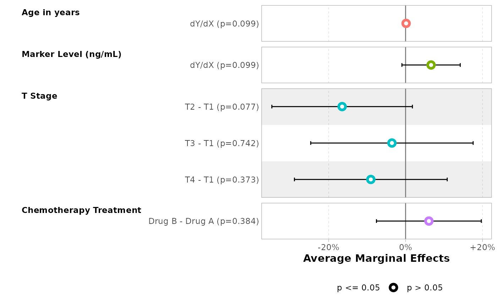

Please note that for categorical variables, marginal contrasts are
returned.

Same results could be obtained with
[`margins::margins()`](https://rdrr.io/pkg/margins/man/margins.html)
function inspired by **Stata**’s `margins` command. As
[`margins::margins()`](https://rdrr.io/pkg/margins/man/margins.html) is
not compatible with
[`stats::poly()`](https://rdrr.io/r/stats/poly.html), we will rewrite
our model, replacing `poly(age, 2)` by `age + age^2`.

``` r
mod_alt <- glm(
  response ~ trt * marker + stage + age + age^2,
  data = d,
  family = binomial
)
margins::margins(mod_alt) |> tidy()
#> # A tibble: 6 × 5
#>   term      estimate std.error statistic p.value
#>   <chr>        <dbl>     <dbl>     <dbl>   <dbl>
#> 1 age        0.00397   0.00236     1.68   0.0927
#> 2 marker     0.0710    0.0380      1.87   0.0617
#> 3 stageT2   -0.164     0.0922     -1.78   0.0754
#> 4 stageT3   -0.0351    0.106      -0.330  0.742 
#> 5 stageT4   -0.0895    0.100      -0.891  0.373 
#> 6 trtDrug B  0.0600    0.0689      0.871  0.384
```

For [broom.helpers](https://larmarange.github.io/broom.helpers/),
[gtsummary](https://github.com/ddsjoberg/gtsummary) or
[ggstats](https://larmarange.github.io/ggstats/), use
[`tidy_margins()`](https://larmarange.github.io/broom.helpers/dev/reference/tidy_margins.md).

``` r
mod_alt |>
  tbl_regression(
    tidy_fun = tidy_margins,
    estimate_fun = scales::label_percent(style_positive = "plus")
  ) |>
  bold_labels()
```

[TABLE]

### Marginal Effects at the Mean (MEM)

For marginal effects at the mean[²](#fn2), simple use
`newdata = "mean"`.

``` r
mod |>
  tbl_regression(
    tidy_fun = tidy_avg_slopes,
    newdata = "mean",
    estimate_fun = scales::label_percent(style_positive = "plus"),
    label = list(age = "Age in years")
  ) |>
  bold_labels()
```

[TABLE]

``` r
mod |>
  ggstats::ggcoef_model(
    tidy_fun = tidy_avg_slopes,
    tidy_args = list(newdata = "mean"),
    variable_labels = c(age = "Age in years")
  ) +
  ggplot2::scale_x_continuous(
    labels = scales::label_percent(style_positive = "plus")
  )
#> Scale for x is already present.
#> Adding another scale for x, which will replace the existing scale.
```

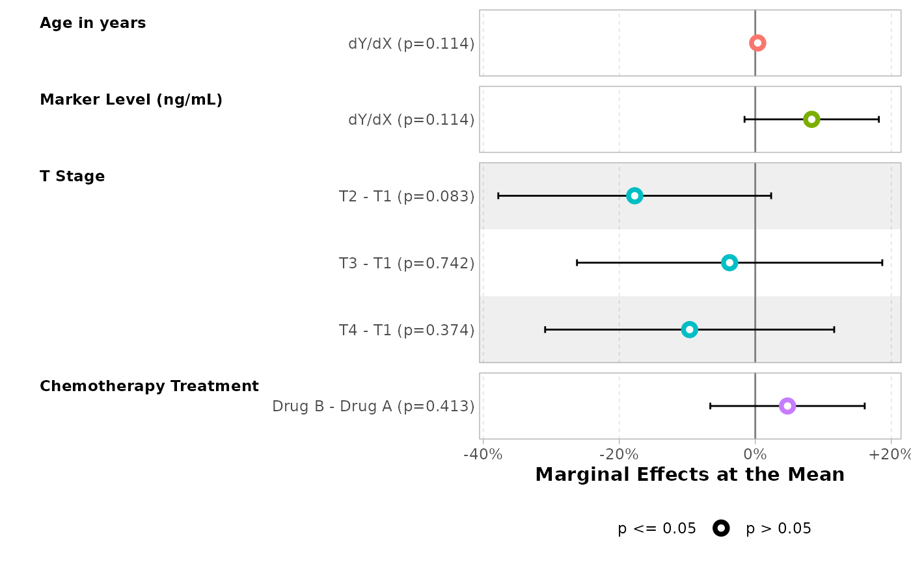

### Marginal Effects at Marginal Means

Simply use `newdata = "balanced"`.

``` r
mod |>
  tbl_regression(
    tidy_fun = tidy_avg_slopes,
    newdata = "balanced",
    estimate_fun = scales::label_percent(style_positive = "plus"),
    label = list(age = "Age in years")
  ) |>
  bold_labels()
```

[TABLE]

``` r
mod |>
  ggstats::ggcoef_model(
    tidy_fun = tidy_avg_slopes,
    tidy_args = list(newdata = "balanced"),
    variable_labels = c(age = "Age in years")
  ) +
  ggplot2::scale_x_continuous(
    labels = scales::label_percent(style_positive = "plus")
  )
#> Scale for x is already present.
#> Adding another scale for x, which will replace the existing scale.
```

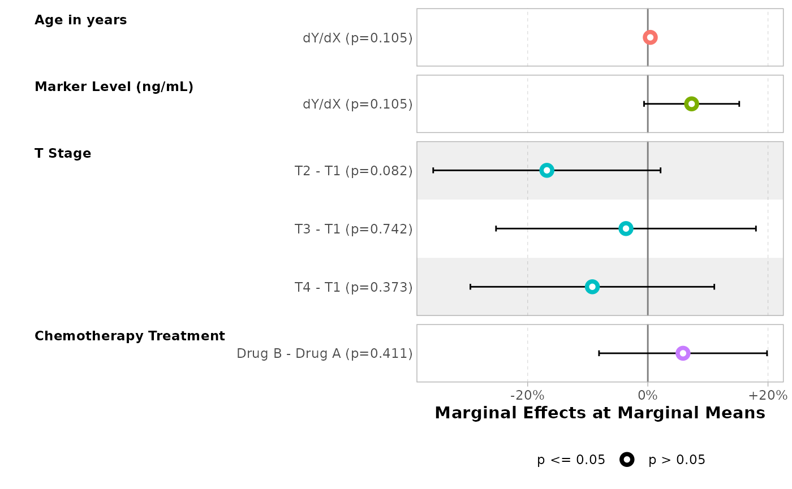

## Further readings

- [Documentation of the `marginaleffects`
  package](https://vincentarelbundock.github.io/marginaleffects/) by
  Vincent Arel-Bundock
- [Marginalia: A guide to figuring out what the heck marginal effects,
  marginal slopes, average marginal effects, marginal effects at the
  mean, and all these other marginal things
  are](https://www.andrewheiss.com/blog/2022/05/20/marginalia/) by
  Andrew Heiss
- [Introduction to Adjusted Predictions and Marginal Effects in
  R](https://strengejacke.github.io/ggeffects/articles/introduction_marginal_effects.html)
  by Daniel Lüdecke
- [An Introduction to
  `margins`](https://cran.r-project.org/package=margins/vignettes/Introduction.html)

------------------------------------------------------------------------

1.  The function `marginaleffects::marginalmeans()` is now deprecated.

2.  More precisely, `marginaleffects::marginaleffects()` use the mean of
    continuous variables and the mode of categorical variables.
